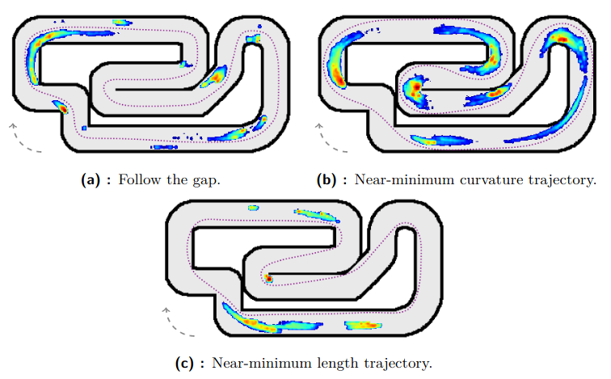
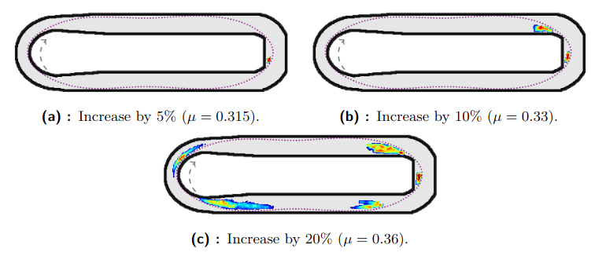
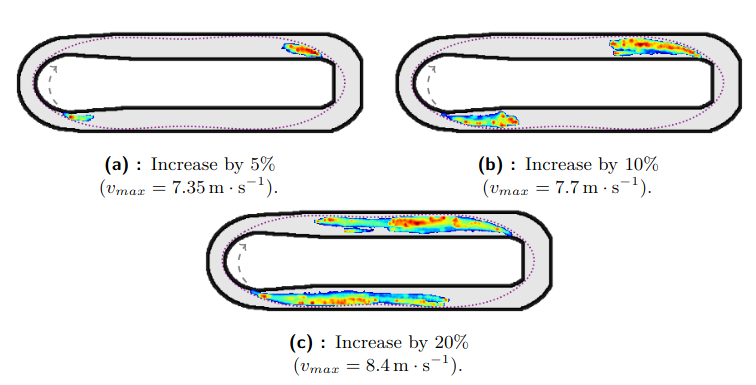

# Optimization tool for planning overtaking maneuvers
This tool is a part of the master's thesis of Tomáš Nagy. 

It is based on a [`ng_trajectory`](https://github.com/jara001/ng_trajectory?tab=readme-ov-file)[1] tool for global trajectory optimization.

To view the package documentation either run `ng_help`.

This tool was used to identify possible overtaking zones on a given track when the opponent's racing line is known. Moreover, we assume that the opponent cannot perform a blocking move (F1TENTH vehicles do not have a rear-facing sensor). Examples can be seen in the Section "Overtaking zones examples". The detail description of this tool and the results can be found in `!NOT YET PUBLISHED!`.

## Requirements

- `Python>=3.6`
- `nevergrad==0.3.0`
- `scipy>=0.18.0`
- `numpy>=1.12.0`
- `Pillow>=4.2.0`
- `tqdm`

### Optional requirements

- `matplotlib` for plotting the results (tested on 3.6.0)
- `rospy` for publishing the results to various ROS topics
- `shapely` (EXPERIMENTAL) for computing the Matryoshka transformation with a different method

## Overtaking zones examples
We optimized many different maneuvers while varying initial position to determine possible overtaking zones. We present the overtaking zones in the form of a heat map where red means "most of the overtakes happened at this place".

### Example 1
In this example, the opponent drives different trajectory types (purple dotted line). 

### Example 2
In this example, the ego vehicle has a friction coefficient increased. The opponent's trajectory is the purple dotted line.

### Example 3
In this example, the ego vehicle has a maximum speed increased. The opponent's trajectory is the purple dotted line.

## Citing

[1]: J. Klapálek, A. Novák, M. Sojka and Z. Hanzálek, "Car Racing Line Optimization with Genetic Algorithm using Approximate Homeomorphism," 2021 IEEE/RSJ International Conference on Intelligent Robots and Systems (IROS), 2021, pp. 601-607, doi: 10.1109/IROS51168.2021.9636503.
