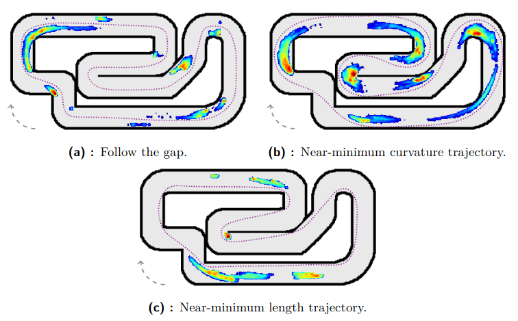
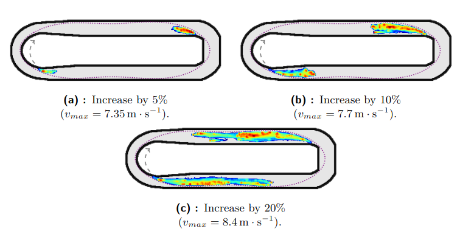

# Optimization tool for planning overtaking maneuvers
This tool is a part of the master's thesis of Tomáš Nagy.

Repository: [DP-Overtaking-Zones](https://github.com/CTU-F1T/DP-Overtaking-Zones)

This tool was used to identify possible overtaking zones on a given track when the opponent's racing line is known. Moreover, we assume that the opponent cannot perform a blocking move (F1TENTH vehicles do not have a rear-facing sensor). Examples can be seen in the Section "Overtaking zones examples". The detail description of this tool and the results can be found in `!NOT YET PUBLISHED!`.

## Overtaking zones examples
We optimized many different maneuvers while varying initial position to determine possible overtaking zones. We present the overtaking zones in the form of a heat map where red means "most of the overtakes happened at this place".

### Example 1
In this example, the opponent drives different trajectory types (purple dotted line). 

### Example 2
In this example, the ego vehicle has a friction coefficient increased. The opponent's trajectory is the purple dotted line.

### Example 3
In this example, the ego vehicle has a maximum speed increased. The opponent's trajectory is the purple dotted line.

